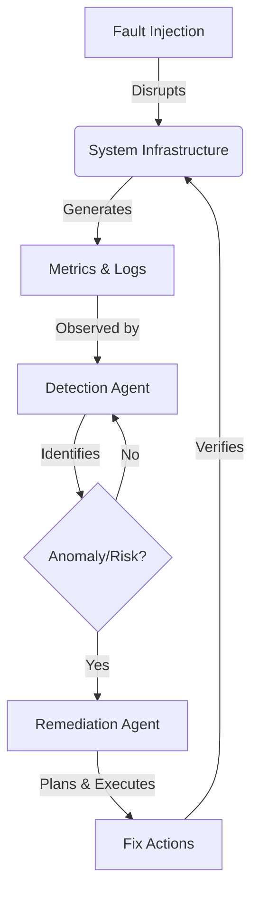

# Autonomous Incident Detection, Prediction & Remediation System

A robust, self-healing system designed to autonomously monitor, predict, and remediate faults in a distributed microservices environment. The system leverages Agentic AI (Gemini Flash 2.0 & NVIDIA NIM) to reason about system state and execute remediation strategies without human intervention.

## 🏗️ Architecture Overview

The system operates on an infinite control loop:



## 🧩 System Components

### 1. Infrastructure (LocalStack Emulation)
Emulates a complete AWS cloud environment locally using LocalStack.
- **S3**: Storage for logs, metric archives, and incident artifact records.
- **DynamoDB**: NoSQL database for tracking agent decisions, LLM actions, and incident history.
- **CloudWatch**: Centralized aggregation for real-time logs and metrics.
- **Lambda**: Serverless functions for generating synthetic traffic and heartbeat metrics.

### 2. Agentic Reasoning Core
Powered by **Gemini Flash 2.0** and **NVIDIA NIM**.
- **Detection Agent**: Continuously polls monitoring data, detecting active failures and predicting future risks based on trends.
- **Remediation Agent**: Formulates a step-by-step plan to fix detected issues, executes CLI commands, and verifies resolution.

### 3. Fault Injection Engine
Simulates real-world production failures to test system resilience:
- CPU Saturation / Spikes
- Memory Leaks & OOM Errors
- Disk Space Exhaustion
- Service Crashes & Network Latency
- "Error Storms" (Log spikes)

### 4. Operations Dashboard
A Flask-based UI for real-time observability:
- Live metric streams and log feeds.
- Interactive incident timeline.
- deep-dive into LLM reasoning traces (Chain of Thought).
- System health status at a glance.

---

## 🚀 Installation & Setup

### Prerequisites
- **Python 3.8+**
- **Docker & Docker Compose** (Must be running)
- **Git**

### 1. Clone the Repository
```bash
git clone https://github.com/GameOn223/Heal-Ops.git
cd autonomous-system
```

### 2. Environment Configuration
Create a `.env` file from the example template.
```bash
cp .env.example .env
```
Update `.env` with your API keys:
- `GEMINI_API_KEY`: Required for the reasoning agents.
- `NVIDIA_API_KEY`: Required for specialized model inference.

### 3. Install Python Dependencies
```bash
pip install -r requirements.txt
```

### 4. LocalStack Setup (Detailed)
This project uses **LocalStack** to emulate AWS services locally.

**Option A: Using Docker Compose (Recommended)**
The included `docker-compose.yml` is pre-configured for this project.
```bash
docker-compose up -d
```
*Wait for a few moments for the container to fully initialize.*

**Option B: Manual Installation (CLI)**
If you prefer managing LocalStack via CLI:
```bash
pip install localstack
localstack start -d
```

**Verification:**
Visit [http://localhost:4566/health](http://localhost:4566/health) to confirm LocalStack is running. You should see a JSON response indicating service status.

---

## ⚡ Quick Start Guide

Once dependencies are installed and LocalStack is running:

### Step 1: Provision Infrastructure
Sets up S3 buckets, DynamoDB tables, and CloudWatch groups.
```bash
python infrastructure/setup.py
```

### Step 2: Deploy Lambda Functions
Packages and deploys the metric generator functions to LocalStack.
```bash
python infrastructure/deploy_lambdas.py
```

### Step 3: Start the Dashboard
Launch the observability UI in a separate terminal.
```bash
python dashboard/app.py
```
*Access at: http://localhost:5000*

### Step 4: Run the Autonomous Loop
Start the main orchestrator agent. This script runs the Detection and Remediation agents.
```bash
python agents/orchestrator.py
```

---

## 📊 Database Schema (DynamoDB)

- **`llm_actions`**: Audit log of every prompt sent to the LLM and its response.
- **`incidents`**: Registry of detected failures, including timestamp, severity, and type.
- **`remediations`**: Tracking of all fix attempts, their execution output, and success status.
- **`agent_decisions`**: storage of internal reasoning traces and "thought" processes.

## 🛡️ Design Principles

- **Autonomous**: Zero interactions required after startup. The system manages its own lifecycle.
- **Observable**: Every internal state change and AI decision is logged and viewable.
- **Resilient**: Designed to recover from the very faults it injects.
- **Auditable**: Complete traceability from anomaly detection to command execution.
